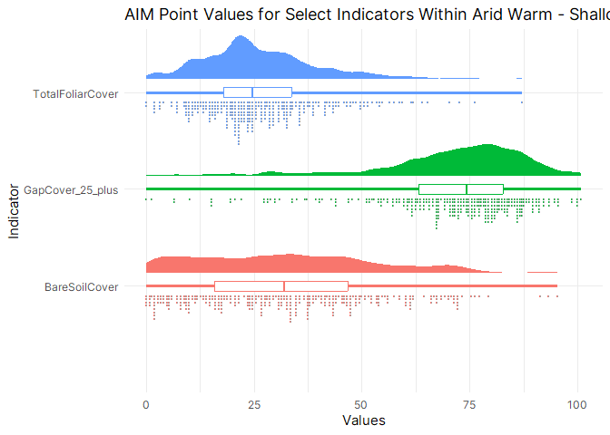

## Introduction
The Tres Rios Field Office is in the process of planning a five year Assessment, Inventory, and Monitoring design.  For this effort we need benchmarks to compare each plot to.  In the past Ecological Site Descriptions (ESDs) were used to stratify the points into ecological units and provide quantitative benchmarks.  However, much of the Tres Rios Field Office lacks ESDs and where they do exist the descriptions are often unhelpful for comparison. For example, some ESDs provide cover percent estimates for structural groups, which is directly comparable to AIM data indicators, but many just provide ibs/acre making AIM data ESD comparisons challenging.  Ecological Site Groups (ESGs) were developed by Naumen et al. (2022) as an alternative or evolution to Ecological Site Descriptions. ESGs are Soil Geomorphologic Units (SGU) that are further divided into climactic zones.  SGUs were developed, in part, by grouping ESDs.  Importantly, and unlike ESDs, ESGs were predicted accross the Colorado Plataea at a 30m resolution privding a estimated ESG for each pixel.  ESDs are similarly mapped but are grouped so that each spatial unit contains multiple ESDs.  Additionally ESDs are arbitrarily broken up into Major Land Resource Areas (MLRAs) and there are inconsistencies between how soils and sites are mapped between MLRAs. Ecological Side Groups were mapped systematically across a large area. Nonethesless, both of these approaches are imperfect. However, given the ease of stratification using ESGs, vs. ESDs, and the geographic consistency over a large area, we decided to use ESGs to make benchmarks for our next 5 year design. 

In this analysis we use ESGs to stratify existing AIM points to develop benchmarks that are divided into Suitable, Marginal and Unsuitable ratings.

## Methods
We developed benchmarks for the following AIM indicators (20): BareSoilCover, TotalFoliarCover, GapCover_25_plus, GapCover_101_200, GapCover_200_plus, AH_NonNoxPerenForbCover, Hgt_PerenForb_Avg, AH_NonNoxPerenGrassCover, Hgt_NonNoxPerenGrass_Avg, AH_NonNoxShrubCover, AH_NonNoxTreeCover, AH_NoxAnnGrassCover, AH_NoxCover, NumSpp_NoxPlant, AH_SagebrushCover, Hgt_Sagebrush_Avg, pct_sagebrush_dead, SoilStability_Protected, SoilStability_Unprotected, FH_WoodyAndHerbLitterCover. Two of these were calculated `pct_sagebrush_dead` (`(AH_SagebrushCover-AH_SagebrushCover_Live)/AH_SagebrushCover)*100`) and `FH_WoodyAndHerbLitterCover` (`FH_WoodyLitterCover+FH_HerbLitterCover`) but the rest we pulled raw from the the BLM SDE server. These benchmarks were chosen because we believe they represent useful tools in managing the Tres Rios Field Office.  This methodology could be used for any benchmark collected as part of a core method as part of the AIM protocol. 

Benchmarks were developed by first categorizing (joining) each AIM or LMF point by individual ESG. All AIM and LMF points that overlapped any ESG were used. Then for each indicator, within each category, min, max and quartiles were calculated. 

Then the quartiles were divided into suitable, marginal and unsuitable.  In most cases two quartiles were grouped to form a suitable rating, marginal was one quartile and unsuitable was one quartile.  For some indicators suitable was the first and second quartile, marginal was the the third quartile and unsuitable was the fourth quartile. All combinations were considered.  

Table: Each indicator and the quartile rankings by suitable, moderate and unsuitable.

|Indicator                  |Q1         |Q2       |Q3         |Q4         |
|:--------------------------|:----------|:--------|:----------|:----------|
|AH_NonNoxTreeCover         |Marginal   |Suitable |Suitable   |Unsuitable |
|TotalFoliarCover           |Unsuitable |Suitable |Suitable   |Marginal   |
|AH_SagebrushCover          |Unsuitable |Suitable |Suitable   |Marginal   |
|Hgt_Sagebrush_Avg          |Unsuitable |Suitable |Suitable   |Marginal   |
|FH_WoodyAndHerbLitterCover |Unsuitable |Suitable |Suitable   |Marginal   |
|AH_NonNoxShrubCover        |Unsuitable |Suitable |Suitable   |Marginal   |
|AH_NonNoxPerenForbCover    |Unsuitable |Marginal |Suitable   |Suitable   |
|Hgt_PerenForb_Avg          |Unsuitable |Marginal |Suitable   |Suitable   |
|AH_NonNoxPerenGrassCover   |Unsuitable |Marginal |Suitable   |Suitable   |
|Hgt_NonNoxPerenGrass_Avg   |Unsuitable |Marginal |Suitable   |Suitable   |
|SoilStability_Protected    |Unsuitable |Marginal |Suitable   |Suitable   |
|SoilStability_Unprotected  |Unsuitable |Marginal |Suitable   |Suitable   |
|BareSoilCover              |Suitable   |Suitable |Marginal   |Unsuitable |
|pct_sagebrush_dead         |Suitable   |Suitable |Marginal   |Unsuitable |
|NumSpp_NoxPlant            |Suitable   |Suitable |Marginal   |Unsuitable |
|GapCover_25_plus           |Suitable   |Suitable |Marginal   |Unsuitable |
|GapCover_101_200           |Suitable   |Suitable |Marginal   |Unsuitable |
|GapCover_200_plus          |Suitable   |Suitable |Marginal   |Unsuitable |
|AH_NoxCover                |Suitable   |Marginal |Unsuitable |Unsuitable |
|AH_NoxAnnGrassCover        |Suitable   |Marginal |Unsuitable |Unsuitable |

These ranges were chosen based on professional judgement.  In many cases it made sense to have Suitable center around the median, with some indicators having the fourth quartile be marginal and the first unsuitable.  For instance AH_SagebrushCover we figured more sagebrush is less bad then too little. Therefore we concluded that the fourth quartile should be marginal and the first quartile should be unsuitable.  This is the same approach the the BLM Gunnison sage-grouse habitat suitability rankings use.  In some cases, however, it made the most sense to have the third and fourth quartiles represent suitable as was the case with AH_NonNoxPerenForbCover, Hgt_PerenForb_Avg, AH_NonNoxPerenGrassCover, Hgt_NonNoxPerenGrass_Avg, SoilStability_Protected, SoilStability_Unprotected. 

In addition to categorizing these benchmarks we also found it useful to, in some cases, remove zeros from the data for certain indicators.  In many cases we did this because there were so many zeros for that indicator accross quartiles, that more than one quartile ranged from zero to zero.  For more than one indicator all but one quartile was zeros. This fact demonstrates a limitation of this process.  It is broad and general and involves quite a bit of error.  However, we find these generalizations to be reasonable when comparing this approach to ESDs which contain large gaps in our field office and in many cases do not suggest plant coverages or heights but plant production.

